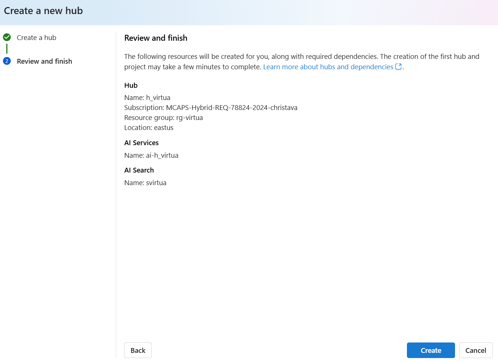

# Setup of AI Studio (ARM Template)

[](https://portal.azure.com/#create/Microsoft.Template/uri/https%3A%2F%2Fraw.githubusercontent.com%2Fctava-msft%2Fai-workshop-2%2Fmain%2Fazuredeploy.json)

This arm file sets up Azure AI Studio with connected resources.

Azure AI Studio is built on Azure Machine Learning as the primary resource provider and takes a dependency on the Cognitive Services (Azure AI Services) resource provider to surface model-as-a-service endpoints for Azure Speech, Azure Content Safety, and Azure OpenAI service.

An 'Azure AI Hub' is a special kind of 'Azure Machine Learning workspace', that is kind = "hub".

## Resources

The following table describes the resources created in the deployment:

| Provider and type | Description |
| - | - |
| `Microsoft.Compute` | `An Azure VM Compute` |
| `Microsoft.CognitiveServices` | `An Azure AI Services as the model-as-a-service endpoint provider` |
| `Microsoft.KeyVault` | `A service that safeguards encryption keys and secrets like passwords.` |
| `Microsoft.MachineLearningServices` | `An Azure AI Hub` |
| `Microsoft.Storage` | `A service that provides scalable and secure cloud storage for a variety of data objects.` |

## Learn more

If you are new to Azure AI studio, see:

- [Azure AI studio](https://aka.ms/aistudio/docs)

If you are new to Azure Machine Learning, see:

- [Azure Machine Learning service](https://azure.microsoft.com/services/machine-learning-service/)
- [Azure Machine Learning documentation](https://docs.microsoft.com/azure/machine-learning/)
- [Azure Machine Learning compute instance documentation](https://docs.microsoft.com/azure/machine-learning/concept-compute-instance)
- [Azure Machine Learning template reference](https://docs.microsoft.com/azure/templates/microsoft.machinelearningservices/allversions)
- [Quickstart templates](https://azure.microsoft.com/resources/templates/)

# Workshop: Operationalize LLMs with LLMOps automation

This workshop provides an in-depth guide on how to operationalize Language Models (LMs) using LLMOps automation techniques. Participants will learn about the best practices for deploying LLMs in production environments. The workshop covers various aspects of LLMOps, including prompt flows and AI deployments.

## Azure services and related products

- Azure AI Studio
- Azure OpenAI
- Azure Hub
- Azure Prompt Flows
- Azure AI Deployments

## Solution architecture


The diagram shows the solution architecture of an AI project within Azure AI Studio. The AI Studio Hub includes the the Azure Subcription, Resource Group, and Azure Content Safety service. The AI Studio Hub provides integration with services including Azure OpenAI, Azure AI Search, and Azure Storage Accounts to implement AI-based solutions. The AI Playground offers tools like Chat Playground, Deployments, and Prompt Flow, that enable get quick and easy access to AI models such as GPT-4 and Llama-2 and interactive development tools.

## Manual Setup

In AIStudio, please create a hub and review and then press the Create button.




Then, create a project


Finally, Deploy GPT-4 language model as follows:


Click Confirm:


Click Deploy:


# Task 01 - Chat in the Azure AI Studio Playground

## Introduction

In an effort to evaluate the use of AI in their organization, Quality Healthcare has identified the use case of employing language models to help extract information, determine sentiment, and summarize the content of conversations between their customers and the company's customer support representatives. By evaluating GenAI use cases in AI Studio, this will serve as a preliminary test to determine the feasibility of using AI in their organization.

## Description

In this task, you will leverage the Azure AI Studio Playground and a Language Model to summarize and extract information from a file. At this time, Quality Healthcare is not looking for a programming-based solution, but rather a simple way to test the use of a Language Model for their use case. The goal is to determine if the model can accurately extract the required information.

The key tasks are as follows:

1. Use [Azure AI Studio](https://ai.azure.com) to create a project and AI Hub along with its underlying Azure resources.

2. Open the Azure AI Studio Project Playground - Chat - to interact with the deployed model.


4. In the Azure AI Studio Playground, author and set a system message that directs the LM to extract information and output the result formatted as JSON. Having the output as JSON allows for the ease of integration of these results at a later time into other systems. The JSON should contain the following information (you may specify your choice of field names):
    ```text
    You are a data analyst. Your job is to extract summary information from files by creating JSON. You always try to extract and format as a JSON:
    1. Mean Age [Age]
    2. Mean Pregnancies [Pregnancies]
    3. Number of patients with Diabetes (outcome=1) [outcome]
    Only extract information that you're sure. If you're unsure, write "Unknown/Not Found" in the JSON file.
    ```


Be sure to Accept Changes and Continue:


5. Upload data to chat with


## Success Criteria

* The system message, when used with the LM, results in the LM returning accurate and properly formatted JSON based on the provided conversation transcript.

## Solution

<details markdown="block">
<summary>Expand this section to view the solution</summary>
</details>


# Task 02 - Create, complete, and test a Prompt Flow

## Introduction

Quality Healthcare has identified Prompt Flow as a powerful tool to assist in delivering AI solutions. Quality Healthcare is interested in investigating the visualized graph within Prompt Flow to create, customize, and orchestrate AI logic with an intuitive user interface.

## Description

In this task, you will create and execute a visual Prompt Flow within Azure AI Studio.

Key steps include:

1. Create a Prompt Flow in Azure AI Studio using the system message authored in the first Task.
2. Become familiar with the Prompt Flow editor and the Graph visualization.
3. Execute the flow within Azure AI Studio using the `GPT-4o` model.
4. Verify the flow responds correctly to a conversation transcript.

## Success Criteria

* Create a Prompt Flow in Azure AI Studio.
* Execute the flow within Azure AI Studio using the `GPT-4o` model.

## Solution

<details markdown="block">
<summary>Expand this section to view the solution</summary>

##### 1) Create a Prompt Flow

Great, now that you have seen how you can deploy models, test them in the playground, and also seen a bit of how Content Safety works, let's see how you can create an orchestration flow for your LLM application in Prompt Flow.

1. In [Azure AI Studio](https://ai.azure.com), open the project that was created (if it's not already open) and return to the Chat Playground by selecting `Chat` from the left menu that is located beneath the **Project playground** heading.

2. In the **Chat playground** ensure the `gpt-4o` model is selected in the **Deployment** drop down.

3. In the **System message** text field, add the following text. This is the same system message that was used earlier in the exercise. Select **Apply Changes** to save the system message.

    ```text
    You are a data analyst. Your job is to extract summary information from files by creating JSON. You always try to extract and format as a JSON:
    1. Mean Age [Age]
    2. Mean Pregnancies [Pregnancies]
    3. Number of patients with Diabetes (outcome=1) [outcome]
    Only extract information that you're sure. If you're unsure, write "Unknown/Not Found" in the JSON file.
    ```


4. Now that the system message is saved, select **Prompt flow** from the taskbar menu above the chat. A dialog will display asking about customization, leave the default settings and select **Open**.

5. In a few moments, the Prompt Flow editor will open. This is where you can create a flow that orchestrates the execution of multiple models and services.

6. To the right of the screen, observe the **Graph** section. This visualization displays the steps the flow will take to process the inputs and generate the outputs.


7. In the **Graph** section, select the **chat** node. This will highlight the associated **chat** node editor in the center of the screen. Ensure a **Connection** is selected.

8. Review the flow's configuration for api, deployment, prompt, and parameters like temperature and max_tokens. These values are model parameters that can be adjusted to customize the behavior of the model, or quickly test different configurations.

9. At the top of the flow editor (scroll to the top of the middle panel), there is an **Inputs** section, notice there are two inputs, **chat_history** and **question**. These are variables that are passed into the flow along with an individual chat completion request. If you look at the **Prompt** field in the **chat** node editor, you'll see how the variables are used in the prompt. The final rendered prompt is what gets sent into the large language model. This happens at each request because calls to the LLM are stateless.

10. To execute the flow within Azure AI Studio, you'll require a Runtime. To initiate it, select the **Start compute session** option from top taskbar menu.


11. In about a minute, the **Start compute session** button will change to a message indicating **Compute session running**. Select the **Chat** button next to this message to start interacting with the flow.


12. A **Chat** dialog displays. Copy and paste the following content into the chat box and press send (if you encounter a 404 error, please verify you selected a connection). This is the same conversation transcript that was used earlier in the exercise.

```text

```

13. Notice the chat results responds to the incoming transcript correctly.


> [!IMPORTANT]
> If you encounter an error like the one below, please add the `Reader` role to the `storage account` that is associated with the `Azure AI Studio` workspace.


</details>