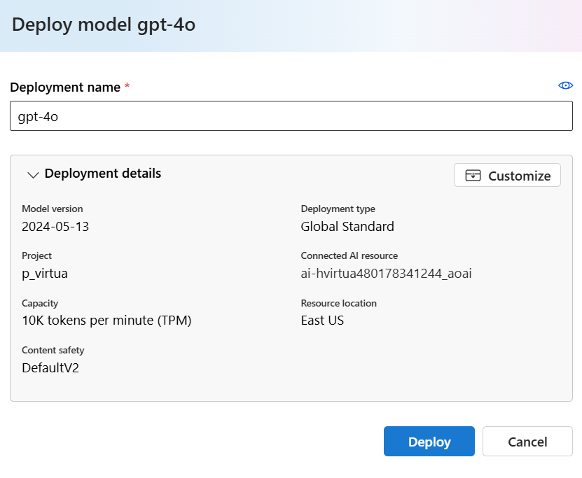

# Setup of AI Studio (ARM Template)

[](https://portal.azure.com/#create/Microsoft.Template/uri/https%3A%2F%2Fraw.githubusercontent.com%2Fctava-msft%2Fai-workshop-2%2Fmain%2Fazuredeploy.json)

This arm file sets up Azure AI Studio with connected resources.

Azure AI Studio is built on Azure Machine Learning as the primary resource provider and takes a dependency on the Cognitive Services (Azure AI Services) resource provider to surface model-as-a-service endpoints for Azure Speech, Azure Content Safety, and Azure OpenAI service.

An 'Azure AI Hub' is a special kind of 'Azure Machine Learning workspace', that is kind = "hub".

## Resources

The following table describes the resources created in the deployment:

| Provider and type | Description |
| - | - |
| `Microsoft.Compute` | `An Azure VM Compute` |
| `Microsoft.CognitiveServices` | `An Azure AI Services as the model-as-a-service endpoint provider` |
| `Microsoft.KeyVault` | `A service that safeguards encryption keys and secrets like passwords.` |
| `Microsoft.MachineLearningServices` | `An Azure AI Hub` |
| `Microsoft.Storage` | `A service that provides scalable and secure cloud storage for a variety of data objects.` |

## Learn more

If you are new to Azure AI studio, see:

- [Azure AI studio](https://aka.ms/aistudio/docs)

If you are new to Azure Machine Learning, see:

- [Azure Machine Learning service](https://azure.microsoft.com/services/machine-learning-service/)
- [Azure Machine Learning documentation](https://docs.microsoft.com/azure/machine-learning/)
- [Azure Machine Learning compute instance documentation](https://docs.microsoft.com/azure/machine-learning/concept-compute-instance)
- [Azure Machine Learning template reference](https://docs.microsoft.com/azure/templates/microsoft.machinelearningservices/allversions)
- [Quickstart templates](https://azure.microsoft.com/resources/templates/)

# Workshop: Operationalize LLMs with LLMOps automation

This workshop provides an in-depth guide on how to operationalize Language Models (LMs) using LLMOps automation techniques. Participants will learn about the best practices for deploying LLMs in production environments. The workshop covers various aspects of LLMOps, including prompt flows and AI deployments.

## Azure services and related products

- Azure AI Studio
- Azure OpenAI
- Azure Hub
- Azure Prompt Flows
- Azure AI Deployments

## Solution architecture


The diagram shows the solution architecture of an AI project within Azure AI Studio. The AI Studio Hub includes the the Azure Subcription, Resource Group, and Azure Content Safety service. The AI Studio Hub provides integration with services including Azure OpenAI, Azure AI Search, and Azure Storage Accounts to implement AI-based solutions. The AI Playground offers tools like Chat Playground, Deployments, and Prompt Flow, that enable get quick and easy access to AI models such as GPT-4 and Llama-2 and interactive development tools.

## Manual Setup

In AIStudio, please create a hub and review and then press the Create button.


Then, create a project


Finally, Deploy GPT-4 language model as follows:


Click Confirm:


Click Deploy:




# Task 01 - Chat in the Azure AI Studio Playground

## Introduction

In an effort to evaluate the use of AI in their organization, Quality Healthcare has identified the use case of employing language models to help extract information, determine sentiment, and summarize the content of conversations between their customers and the company's customer support representatives. By evaluating GenAI use cases in AI Studio, this will serve as a preliminary test to determine the feasibility of using AI in their organization.

## Description

In this task, you will leverage the Azure AI Studio Playground and a Language Model to summarize and extract information from a file. At this time, Quality Healthcare is not looking for a programming-based solution, but rather a simple way to test the use of a Language Model for their use case. The goal is to determine if the model can accurately extract the required information.

The key tasks are as follows:

1. Use [Azure AI Studio](https://ai.azure.com) to create a project and AI Hub along with its underlying Azure resources.

2. Open the Azure AI Studio Project Playground - Chat - to interact with the deployed model.


4. In the Azure AI Studio Playground, author and set a system message that directs the LM to extract information and output the result formatted as JSON. Having the output as JSON allows for the ease of integration of these results at a later time into other systems. The JSON should contain the following information (you may specify your choice of field names):
    ```text
        You are an AI assistant that helps people find information.
    ```


Be sure to Accept Changes and Continue:


5. Upload data to chat with


Let's update the parameters and TPM to avoid rate limiting:

 


6. Issue the following queries:

what is the age of the patient?

what is the patient's family history?

what is the patient's occupation?


## Success Criteria

* The responses to the queries are from the document and not an hallucination from LM.

## Solution

<details markdown="block">
<summary>Expand this section to view the solution</summary>


</details>


# Task 02 - Create, complete, and test a Prompt Flow

## Introduction

Quality Healthcare has identified Prompt Flow as a powerful tool to assist in delivering AI solutions. Quality Healthcare is interested in investigating the visualized graph within Prompt Flow to create, customize, and orchestrate AI logic with an intuitive user interface.

## Description

In this task, you will create and execute a visual Prompt Flow within Azure AI Studio.

Key steps include:

1. Create a Prompt Flow in Azure AI Studio using the system message authored in the first Task.
2. Become familiar with the Prompt Flow editor and the Graph visualization.
3. Execute the flow within Azure AI Studio using the `GPT-4o` model.
4. Verify the flow responds correctly to a question about the diabetes outcome.

Create the prompt flow


Start the compute session


Chat with the prompt flow. Issue the following queries:

what is the age of the patient?

what is the patient's family history?

what is the patient's occupation?

## Success Criteria

* Create a Prompt Flow in Azure AI Studio.
* Execute the flow within Azure AI Studio using the `GPT-4o` model and the classification model.

## Solution

<details markdown="block">
<summary>Expand this section to view the solution</summary>


</details>